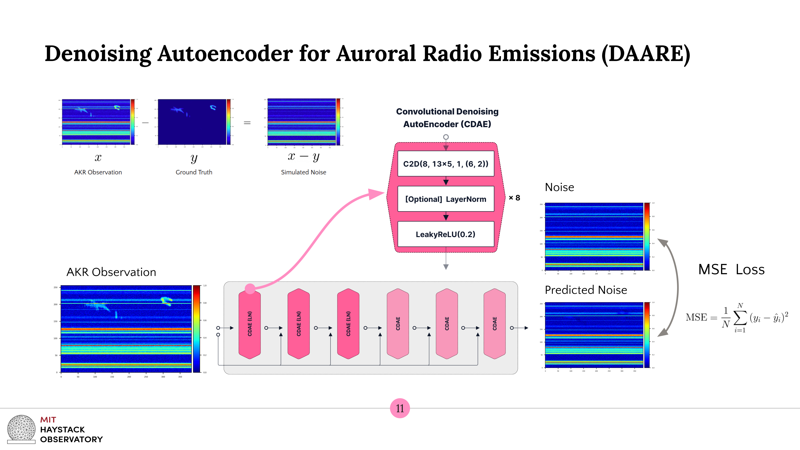

# Denoising Autoencoder for Auroral Radio Emissions
## Table of Contents
1. [About](#about)
2. [Approach](#approach)
3. [Usage](#usage)
4. [Command Line Arguments](#arguments)
5. [API Tutorial](#api)

## <a name="about"></a>About
The Denoising Autoencoder for Auroral Radio Emissions (DAARE) 
is a tool to remove Radio Frequency Interference (RFI) commonly emerging
as horizontal emission lines from time-frequency spectrograms. This tool was
built to denoise Auroral Kilometric Radiation (AKR) observations from
the South Pole Station.

This work was generously supported by National Science Foundation 
grant AST-1950348, conducted at the MIT Haystack Observatory REU 2022 by
Allen Chang, and advised by Mary Knapp.

## <a name="approach"></a>Approach


## <a name="usage"></a>Usage
1. Install required packages.
```
pip install -r requirements.txt
```
2. To train a new model, run [train.py](/train.py).
3. To use a pretrained model, use [api.py](/api.py).

## <a name="arguments"></a> Command Line Arguments
### [train.py](/train.py)
#### Paths
`--path_to_data`: Path to the data directory.

`--path_to_logs`: Path to the logs directory.

`--path_to_output`: Path to the output directory.

#### Run options
`--model_name`: Name of the model when logging and saving.

`--verbose`: Trains with debugging outputs and print statements.                        

`--tqdm_format`: Flag bar_format for the TQDM progress bar.                                  

`--disable_logs`: Disables logging to the output log directory.                               

`--refresh_brushes_file`: Rereads brush images and saves them to [the loaded CSV file](data/brushes/brushes.csv). 

#### Simulation parameters
`--theta_bg_intensity`: Bounds of the uniform distribution to draw background intensity.                      

`--theta_n_akr`: Expected number of akr from the Poisson distribution.                                 

`--theta_akr_intensity`: (Before absolute value) mean and std of AKR intensity.                                

`--theta_gaussian_intensity`: Bounds of the uniform distribution to determine the intensity of Gaussian noise.      

`--theta_overall_channel_intensity`: Bounds of the uniform distribution to determine the overall intensity of channels.    

`--theta_n_channels`: Expected number of channels from the Poisson distribution.                            

`--theta_channel_height`: Expected **half** height of the channel from the exponential distribution.            

`--theta_channel_intensity`: Bounds of the uniform distribution to determine the individual intensity of channels. 

`--disable_dataset_scaling`: Disables scaling of synthetic AKR in the dataset.                                     

`--dataset_intensity_scale`: Mean and standard deviation to scale the images to.

#### Model parameters
`--img_size`: Input size to DAARE.                                                 

`--n_cdae`: The number of stacked convolutional denoising autoencoders in DAARE. 

`--depth`: Depth of each convolutional denoising autoencoder.                   

`--n_hidden`: Size of each hidden conv2d layer.                                    

`--kernel`: Kernel shape for the convolutional layers.                           

`--n_norm`: The first n convolutional autoencoders to apply layernorm to.        

#### Optimization
`--device_ids`: Device ids of the GPUs, if GPUs are available.                            

`--n_train`: The number of training samples that are included in the training set.     

`--n_valid`: The number of validation samples that are included in the validation set. 

`--batch_size`: Batch size of to use in training and validation.                          

`--n_epochs_per_cdae`: The number of epochs to train each convolutional denoising autoencoder.   

`--learning_rate`: The learning rate of each convolutional denoising autoencoder.

## <a name=“api”></a>API Tutorial
The API was developed to load and run a pretrained model 
without needing to have a prior understanding of PyTorch. 
It is also meant to enable easy reading of 
radio data written to disk and spectrogram generation.

### API initialization
```python
from lib.api import DAARE_API

PATH_TO_PRETRAINED = 'daare_pretrained.pt'
api = DAARE_API(PATH_TO_PRETRAINED)
```
### Reading digital_rf files
```python
import numpy as np

# List of file paths
files = ['<path_to_file1>', '<path_to_file2>']
channels = ['ant0', 'ant0']

# Spectrogram parameters
nfft = 1024
bins = 1536
verbose = True

# Read files
obs, freqs, times, starts = api.read_drf(files, channels, 
                                         nfft, bins, verbose=verbose)
```
### Batch denoising with a numpy array
```python
# Larger batch sizes will enable faster
# denoising, though the maximum batch size
# is constrained by the memory available
# on your machine.
batch_size = 16

# DAARE works with 256 x 384 pixel images
# and will resize the spectrogram to fit these
# dimensions. Enabling this flag will
# make the API rescale to the input image
# dimensions; otherwise, it will default to
# return the 256 x 384 pixel output.
retain_size = True

# batch_size, return_same_size, and verbose arguments are optional
obs_denoised = api.denoise(obs, batch_size, retain_size)
```
### Visualize spectrogram
```python
from lib.plot import spects

# Indices of spectrograms to visualize
samples = [0]
# Dimensions of the output figure
nrows_ncols = (len(samples), 2)
# Column that changes the extent of the colorbar
cbar_col = 0
# Plot spectrograms
spects([obs[samples], obs_denoised[samples]], nrows_ncols, cbar_col)
```